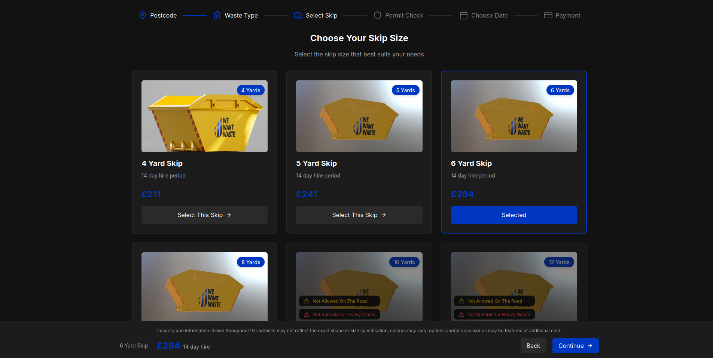
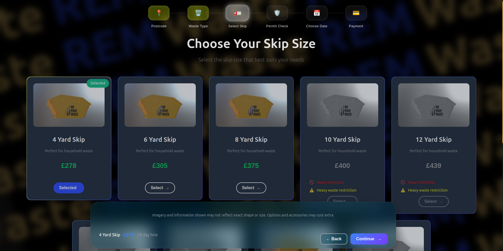

# ♻️ REM Waste - Skip Selection Page Redesign

## 📝 Overview

This project involved a UX/UI redesign of the **"Choose Your Skip Size"** page for **REM Waste**, a UK-based waste management and skip hire service provider. The goal was to enhance usability, aesthetics, and clarity while aligning with modern design principles. The improvements focus on user journey, interaction, accessibility, responsiveness, and brand consistency.

---

## 🧭 Objective

- Improve **user experience** (UX) and **visual interface** (UI) of the skip selection process.
- Optimize for **clarity**, **accessibility**, and **conversion**.
- Create a more **intuitive and visually appealing layout** while retaining all necessary information.
- Highlight **important restrictions** and service limitations in a user-friendly manner.
- Showcase **REM Waste's clean environmental commitment** through a refined UI.

---

## 🔍 Research & Problem Analysis

### Company: [REM Waste](https://remwaste.co.uk)
REM Waste is a leading UK provider of environmentally responsible skip hire and waste management services. Their website serves as a core channel for customers to browse, compare, and book waste solutions.

### Issues in the Original Design:
- **Dark and heavy interface** with poor spacing and readability.
- Limited visual feedback on skip selection.
- Unclear pricing and lack of visual hierarchy.
- Skip restrictions not emphasized enough.
- Lack of responsiveness on some screen sizes.

---

## ✨ My Approach to the Redesign

### 🧩 1. Visual Hierarchy & Layout
- Transformed layout into **modern glassmorphism-based cards** with spacing, shadows, and rounded corners.
- Each skip bin is shown in a consistent grid, making comparison easy and clear.
- Clear **"Selected" badges** with highlighted states for active items.

### 🎨 2. Color Scheme & Branding
- Adopted a **yellowish and bluish color palette** to reflect REM Waste's brand.
- **Glassmorphism design** reflects transparency and cleanliness—symbolic of REM Waste’s environmental values.
- Primary actions are colored with **eco-friendly green or bright yellow highlights**, enhancing visibility and call-to-action focus.

### 📱 3. Improved Usability
- Redesigned **step navigation bar** with large icons and labels for better understanding of progress.
- Added hover and active states for **"Select" and "Selected" buttons**.
- Each skip now includes **a description and ideal use case**, helping users make informed choices.

### ⚠️ 4. Restrictions & Warnings
- Used **color-coded badges**: red for “road restrictions,” yellow for “heavy waste,” etc.
- Disabled skip options when restricted, with tooltip descriptions and faded visuals.
- Ensures users are **informed before making a mistake**.

### 🧠 5. User Interaction & Summary Bar
- **Sticky bottom bar** added for showing selected skip, price, and navigation.
- Makes it easy to navigate back or proceed without scrolling up/down.

---

## 🔧 Tools & Technologies

- **UI Concepts**: Glassmorphism, WCAG 2.1 accessibility, Mobile-first
- **Implementation Stack** (optional): React, Vanila CSS, JavaScript

---

## 📈 Results & Benefits

| Feature                        | Before (Original)                            | After (Improved)                                  |
|-------------------------------|----------------------------------------------|---------------------------------------------------|
| Visual Hierarchy              | Inconsistent layout                          | Clean glass-style cards with strong structure     |
| Selection Feedback            | Minimal indicator                            | Clear “Selected” labels with vibrant colors       |
| Restrictions Display          | Hard to notice                               | Color-coded, visible badges and tooltips          |
| Price Visibility              | Flat blue text                               | Prominent eco-green font, better emphasis         |
| Navigation                    | Simple breadcrumb                           | Icon-based, visually rich step tracker            |
| Color Branding                | Lacked identity                              | Yellow + blue tones reflecting REM Waste’s brand  |
| Eco Representation            | Not emphasized                               | Clean UI conveys REM Waste's **green mission**    |

---

## ✅ Final Thoughts

The new design improves trust, clarity, and ease-of-use, while reinforcing REM Waste’s mission of **clean and sustainable waste management**. This redesign makes the selection process efficient, friendly, and eco-conscious.

---

## 📸 Screenshots

### Before:

### After:

